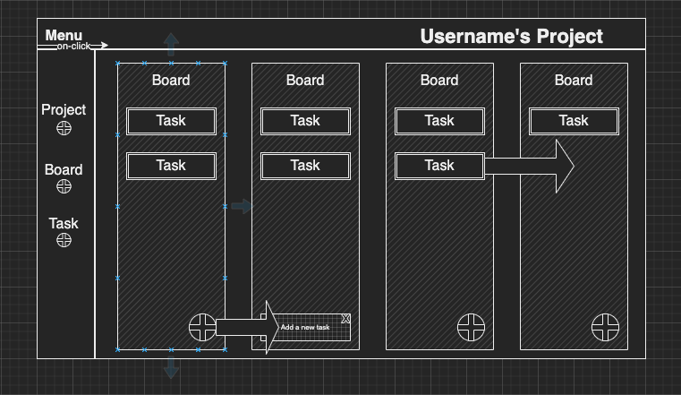
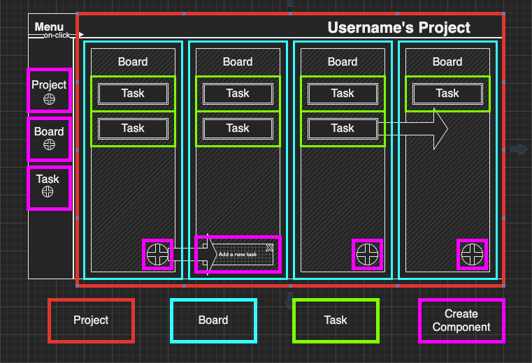

# Wireframes

Goal: Build a kaban board in React 

Break down the potential React components

# User Stories
## Sprint 1
- [ ] create a task by typing in a text box and hitting the enter key or a submit button
- [ ] submission of the first task renders two boards, "to do" and "complete"
- [ ] submitting tasks adds the text to an unordered list "to do" shown on the page
- [ ] display tasks in a list in descending order (oldest on top, newest on bottom)
- [ ] clicking on a task takes displays a modal where you can edit the text or mark the task as complete
- [ ] when a task is marked complete it is removed from the "to do" board and put in the "complete" board
